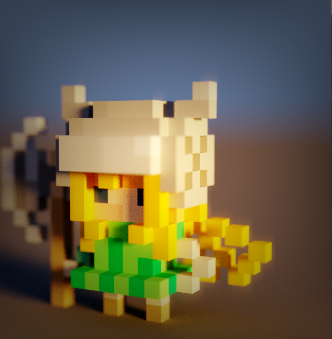
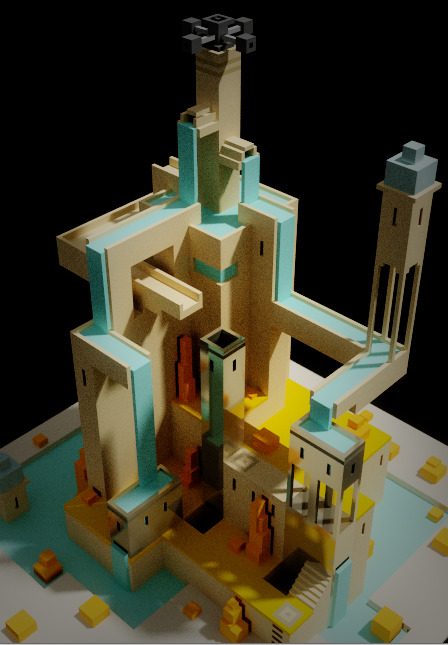
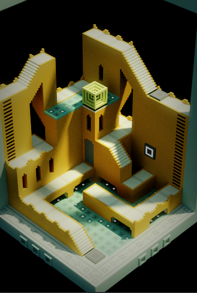
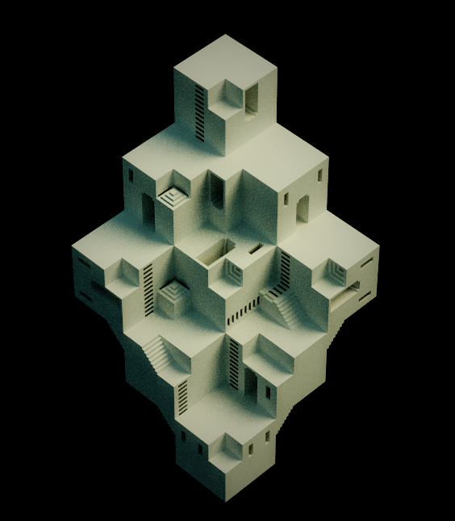
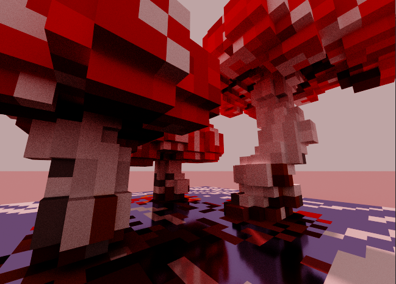
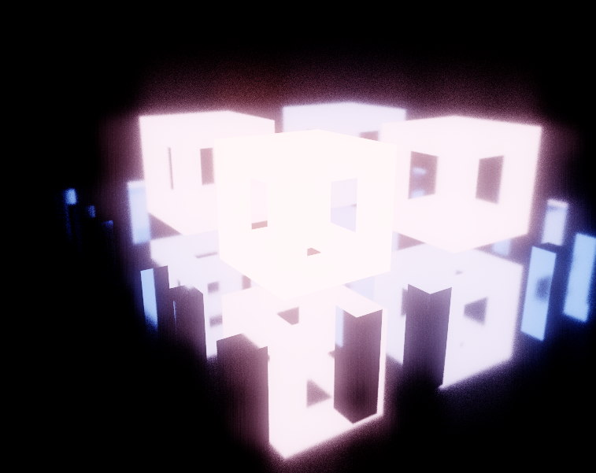
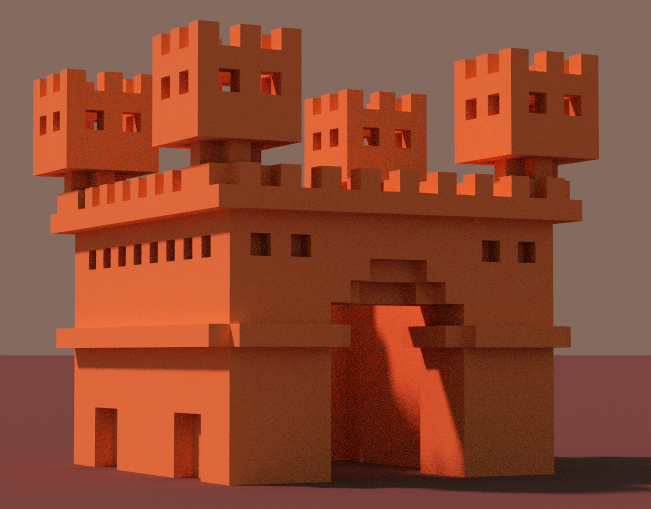
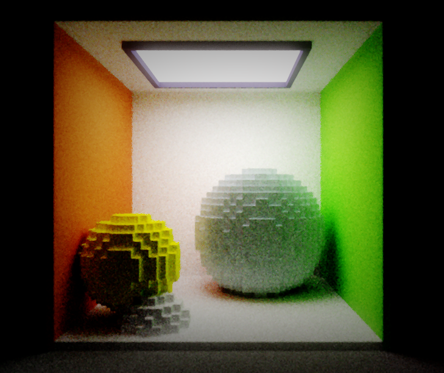
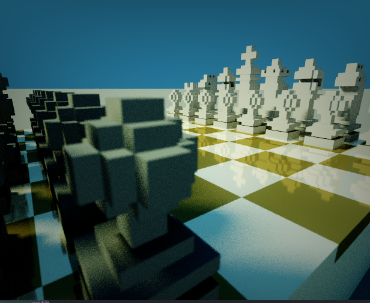

# ocaml_rtx

projet de path tracing en ocaml.

to make it work, write the path of the .vox file in the variable 'path' in the beginging of the stript,
then, recompile the all thing.

# commandes:
  - mouse click on the image to set the focus on the point clicked.

# renders:

  
  
  
  
  
  
  
  
  

