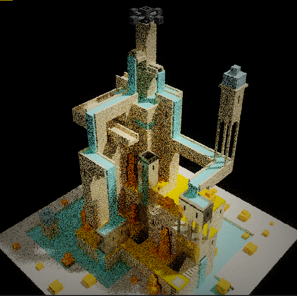
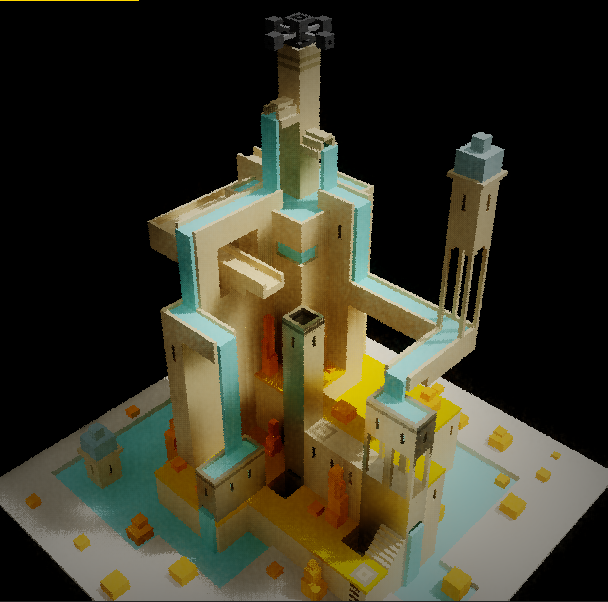

# ocaml_rtx

projet de path tracing en ocaml.

to make it work, write the path of the .vox file in the variable 'path' in the beginging of the stript,
then, recompile the all thing.

# commandes:
  - mouse click on the image to set the focus on the point of the object clicked.
  - push space bar to toggle denoising

(to use adaptive sampling, set adaptive_sampling to true in the beginnig of the program)
# renders:

  
  
  
  
  
  
  
  
  

# denoising:
push space bar to toggle denoising 
(update in the beginning of the next frame if toggle durring post processing periode) 

one sample per pixel, raw vs denoised example:

  
&nbsp; &nbsp; &nbsp; &nbsp;
  

